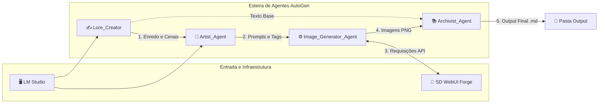

# ⚔️ Auto-Manga Dark Fantasy Generator

Este projeto é uma esteira de produção 100% local e automatizada para a criação de histórias em quadrinhos no estilo **mangá medieval sombrio (Dark Fantasy)**. O sistema utiliza uma arquitetura multi-agentes baseada em **AutoGen**, integrada ao **LM Studio** (processamento de texto) e ao **Stable Diffusion WebUI Forge** (geração de imagens).

---

## 🤖 Como os Agentes Funcionam

O sistema orquestra 4 agentes especialistas que trabalham em sincronia de fluxo contínuo conforme o diagrama abaixo:



* **Lore_Creator:** Gera o enredo, focado em worldbuilding medieval, dividindo a história em capítulos e cenas.
* **Artist_Agent:** Traduz a narrativa visual do capítulo para tags em inglês compatíveis com geração de imagem por IA.
* **Image_Generator_Agent:** O executor técnico. Conecta-se à API do Forge, gera as ilustrações (`.png`) e salva na máquina.
* **Archivist_Agent:** Compila os textos e os links das imagens geradas, salvando o capítulo final formatado em Markdown (`.md`).

---

## 🛠️ Requisitos para Funcionar

Para rodar o projeto no **Ubuntu**, você precisa de três componentes ativos:

### 1. LM Studio (Servidor Local de LLM)
* **Modelo Recomendado:** Hermes (ou similar focado em chat/instruções).
* **Configuração:** O servidor local deve estar ativo expondo o endpoint na porta padrão configurada no seu arquivo `.env` (Multi-Model Session activa).

### 2. Stable Diffusion WebUI Forge (Gerador de Imagens)
* **Modelo Checkpoint:** `animagine-xl-3.1.safetensors` (ou superior) colocado na pasta de modelos do Forge.
* **Inicialização Obrigatória:** O Forge deve ser iniciado via terminal com a flag da API ativa:
  ```bash
  ./webui.sh --api --listen --port 7860
  ```
  *(Recomendado usar `--lowvram` para placas de 6GB de VRAM como a GTX 1660 Ti).*

### 3. Ambiente Python do Projeto
* Instale as dependências contidas no projeto (`pyautogen`, `requests`, `python-dotenv`).
* Um arquivo `.env` configurado na raiz com as chaves: `LM_SERVER_V1`, `OPENAI_API_KEY` (pode ser dummy para o LM Studio) e `LM_MODEL_LORE`.

---

## 🚀 Como Executar

1. Certifique-se de que o **LM Studio** e o **SD WebUI Forge** estão abertos e rodando em segundo plano.
2. No terminal do projeto, execute o script principal:
   ```bash
   python3 app_manga.py
   ```
3. O resultado final (os capítulos em `.md` e as imagens em `.png`) será gerado automaticamente dentro da pasta `output/`.

---

## AutoGen Project Setup (Ubuntu)

Este guia orienta a instalação e configuração do framework **AutoGen** (v0.4+) em um ambiente Ubuntu utilizando `requirements.txt` e um ambiente virtual Python (`venv`).

### 📋 Pré-requisitos

Antes de começar, garanta que o Python 3, o gerenciador de pacotes `pip` e o módulo `venv` estejam instalados no seu Ubuntu:

```bash
sudo apt update
sudo apt install python3-pip python3-venv -y
```

### 🚀 Instalação Passo a Passo

Siga as instruções abaixo no seu terminal para configurar o projeto:

#### 1. Criar e Acessar a Pasta do Projeto
```bash
mkdir meu-projeto-autogen
cd meu-projeto-autogen
```

#### 2. Criar o Arquivo `requirements.txt`
Crie um arquivo chamado `requirements.txt` e adicione as dependências modernas do AutoGen:

```text
autogen-core>=0.4.0
autogen-agentchat>=0.4.0
autogen-ext[openai]>=0.4.0
```

#### 3. Criar e Ativar o Ambiente Virtual
É altamente recomendável isolar as dependências do projeto:

```bash
# Criar o ambiente virtual
python3 -m venv .venv

# Ativar o ambiente virtual
source .venv/bin/activate
```
*(Você saberá que deu certo quando ver `(.venv)` no início da linha do terminal).*

#### 4. Instalar as Dependências
Com o ambiente ativo, atualize o gerenciador e instale o arquivo de requerimentos:

```bash
pip install --upgrade pip
pip install -r requirements.txt
```

---

### 🛠️ Comandos Úteis

* **Ativar o ambiente** (sempre que reabrir o terminal): `source .venv/bin/activate`
* **Desativar o ambiente**: `deactivate`

---

# Troubleshooting

Na hora de atualizar o apt do Ubuntu podem ocorrer problemas que nao vao interromper o linux, mas podem atrapalhar atualizacoes.

1. Warning aparecendo na fase de update do apt

Voce executa o comando

```bash
sudo apt update
```

Apos isso aparecem as seguintes mensagens:

```bash
\$ sudo apt update
Hit:1 https://download.docker.com/linux/ubuntu noble InRelease
Hit:2 http://archive.ubuntu.com/ubuntu noble InRelease
Hit:3 http://security.ubuntu.com/ubuntu noble-security InRelease
Hit:4 http://archive.ubuntu.com/ubuntu noble-updates InRelease
Hit:5 http://archive.ubuntu.com/ubuntu noble-backports InRelease
Hit:6 https://ppa.launchpadcontent.net/deadsnakes/ppa/ubuntu noble InRelease
Reading package lists... Done
Building dependency tree... Done
Reading state information... Done
32 packages can be upgraded. Run 'apt list --upgradable' to see them.
W: Target Packages (stable/binary-amd64/Packages) is configured multiple times in /etc/apt/sources.list.d/archive_uri-https_download_docker_com_linux_ubuntu-noble.list:1 and /etc/apt/sources.list.d/docker.list:1
W: Target Packages (stable/binary-all/Packages) is configured multiple times in /etc/apt/sources.list.d/archive_uri-https_download_docker_com_linux_ubuntu-noble.list:1 and /etc/apt/sources.list.d/docker.list:1
```

O prefixo W: significa Warning (Aviso). 

O Ubuntu está avisando que o repositório oficial do Docker foi adicionado duas vezes em arquivos de configuração diferentes, fazendo com que o apt baixe a mesma lista de pacotes repetidamente. Os dois arquivos conflitantes são:

* `/etc/apt/sources.list.d/archive_uri-https_download_docker_com_linux_ubuntu-noble.list`
* `/etc/apt/sources.list.d/docker.list`

#### 1.1. Remova o arquivo redundante

```bash
sudo rm /etc/apt/sources.list.d/archive_uri-https_download_docker_com_linux_ubuntu-noble.list
```

#### 1.2. Atualize a lista novamente para testar

```bash
# atualize
sudo apt update

# ou faca upgrade
sudo apt upgrade -y
```
